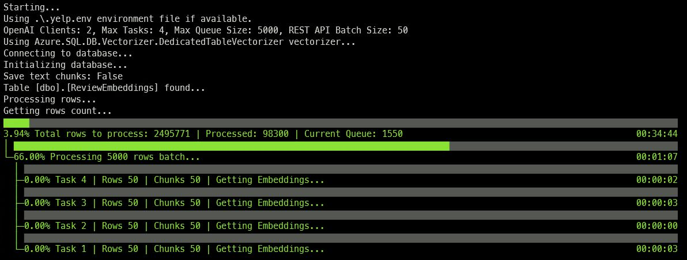

# Azure SQL DB Vectorizer

Quickly generate embeddings from data in Azure SQL. Point to the table that has text that must to turned into embeddings, configure the `.env` file and run the tool, to get text vectorized into embedding as fast as possible.



Embedding will be generated using the OpenAI API. The tool will connect to the Azure SQL Database, read the text from the specified table, send the text to the OpenAI API, and store the embeddings back in the same table. If the read text is too big to fit a single API call, the tool will split the text into chunks and send each chunk to the API.

Chunking is done using the [TextChunker.SplitPlainTextParagraphs](https://learn.microsoft.com/en-us/dotnet/api/microsoft.semantickernel.text.textchunker.splitplaintextparagraphs?view=semantic-kernel-dotnet) method from the [Microsoft.SemanticKernel.Text](https://www.nuget.org/packages/Microsoft.SemanticKernel.Text/) package. Maximum number of token per paragraph is set to 2048.

Embeddings will be stored into a dedicated table. If the table doesn't exist, the tool can create a new table to store the embeddings. The relationship between the original table and the table that stores the embeddings is done using the `id` / `parent_id` column and the relationship is a 1:N relationship, as each row in the original table will have one or more rows in the table that stores the embeddings due to the chunking process.

## Usage

Just run 

```bash
dotnet run
```

or 

```bash 
dotnet run -- .my-env-file
```

if you want to use a different `.env` file.

All confiruation options are read from environment variables. Create a `.env` file starting from the `.env.sample` and specifiy values as per the following instructions:

### OPENAI_URL & OPENAI_KEY ###

The URL and the API Key used to connect to Azure OpenAI or OpenAI. For example:

```bash
OPENAI_URL="https://open-ai-test.openai.azure.com/"
OPENAI_KEY="a12...bdf"
```

to improve performance and scale out horizontally you can specify more URLs and more API keys by separateing them with a comma. The first URL will be used with the first API_KEY, the second URL with the second API_KEY and so on. Calls to OpenAI will be spread round-robin across all the configured URLs.

```bash
OPENAI_URL="https://open-ai-test-1.openai.azure.com/,https://open-ai-test-2.openai.azure.com/"
OPENAI_KEY="a12...bdf, d02...4ee"
```

### OPENAI_EMBEDDING_DEPLOYMENT_NAME ###

The name of the deployment that has the model that will be used to generate the embeddings. For example:

```bash
OPENAI_EMBEDDING_DEPLOYMENT_NAME="my-text-embedding-3-small"
```

All OpenAI url defined in the `OPENAI_URL` must have the same deployment name.

### MSSQL_CONNECTION_STRING ###

The connection string to the Azure SQL Database. For example:

```bash
MSSQL_CONNECTION_STRING="Server=my-server.database.windows.net;Database=sampledb;Authentication=Active Directory Default;"
```

### TABLE_NAME ###

The name of the table that contains the text that must be turned into embeddings. For example:

```bash
TABLE_NAME="dbo.wikipedia_articles_embeddings"
```

### ID_COLUMN_NAME ###

The name of the column that contains the unique identifier for each row in the table. For example:

```bash
ID_COLUMN_NAME="id"
```

The id column must be an integer.

### CONTENT_COLUMN_NAME ###

The name of the column that contains the text that must be turned into embeddings. For example:

```bash
CONTENT_COLUMN_NAME="title"
```

### EMBEDDING_COLUMN_NAME ###

The name of the column that will contain the embeddings. For example:

```bash
EMBEDDING_COLUMN_NAME="title_vector_text3"
```

### EMBEDDING_DIMENSIONS ###

The number of dimensions of the embeddings. For example:

```bash
EMBEDDING_DIMENSIONS=1536
```

### DEDICATED_EMBEDDINGS_TABLE ###

The name of the table that will store the embeddings. For example:

```bash 
DEDICATED_EMBEDDINGS_TABLE="dbo.ReviewEmbeddings"
```

### AUTO_CREATE_DEDICATED_EMBEDDINGS_TABLE ###

If set to `True`, the tool will create a new table to store the embeddings. For example:

```bash
AUTO_CREATE_DEDICATED_EMBEDDINGS_TABLE=True
```

If the table doesn't exist, the tool will create a new table to store the embeddings.

### SAVE_TEXT_CHUNKS ###    

If set to `True`, the tool will save the text chunks that were sent to the OpenAI API. For example:

```bash
SAVE_TEXT_CHUNKS=True
```


