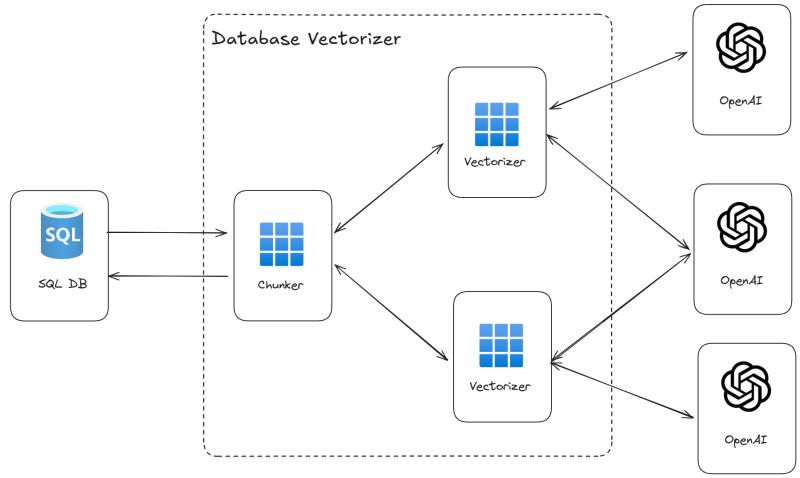
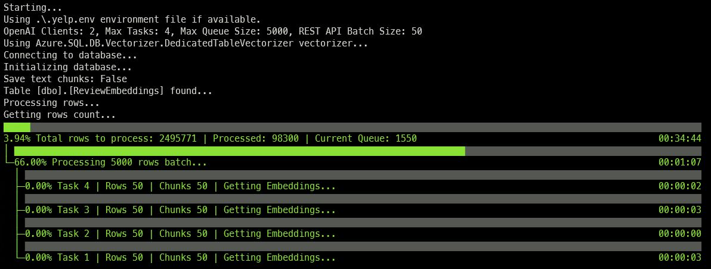

# Azure SQL DB Vectorizer

- [Overview](#overview)
- [Vector support in Azure SQL](#vector-support-in-azure-sql)
- [Usage](#usage)
- [Configuration](#configuration)
- [Usage Sample](#usage-sample)

## Overview

Quickly generate embeddings from data in Azure SQL. Point to the table that has text that must to turned into embeddings, configure the `.env` file and run the tool, to get text vectorized into embedding as fast as possible.



Embedding will be generated using the OpenAI API. The tool will connect to the Azure SQL Database, read the text from the specified table, send the text to the OpenAI API, and store the embeddings back in the table, in a dedicated table. If the read text is too big to fit a single embedding API call, the tool will split the text into chunks and send each chunk to the API.

Chunking is done using the [TextChunker.SplitPlainTextParagraphs](https://learn.microsoft.com/en-us/dotnet/api/microsoft.semantickernel.text.textchunker.splitplaintextparagraphs?view=semantic-kernel-dotnet) method from the [Microsoft.SemanticKernel.Text](https://www.nuget.org/packages/Microsoft.SemanticKernel.Text/) package. Maximum number of token per paragraph is set to 2048.

Embeddings will be stored into a dedicated table. If the table doesn't exist, the tool can create a new table to store the embeddings. The relationship between the original table and the table that stores the embeddings is done using the `id` / `parent_id` column and the relationship is a 1:N relationship, as each row in the original table will have one or more rows in the table that stores the embeddings due to the chunking process.

Rows from the database are processed in batch of 5000 rows. Those rows are read into a queue and then, by default, two threads per each OpenAI URL will pull data from the queue, chunk it if needed, and then send the embedding request to the OpenAI API. Each API call will batch togheter up to 50 text chunks to be vectorized.

Once the queue is empty, the process will start again until all rows in the source table are processed.

## Vector support in Azure SQL

More details vector support in Azure SQL can be found here: 

- [Overview of vector search and vector indexes in the SQL Database Engine](https://learn.microsoft.com/en-us/sql/relational-databases/vectors/vectors-sql-server?view=azuresqldb-current)
- [Vector Data Type](https://learn.microsoft.com/en-us/sql/t-sql/data-types/vector-data-type?view=azuresqldb-current&tabs=csharp)

for more samples, also, check the following repositories:

- [Azure SQL DB and OpenAI](https://github.com/Azure-Samples/azure-sql-db-openai)
- [Chatbot in pure T-SQL](https://github.com/Azure-Samples/azure-sql-db-chatbot)
- [Session Recommender (RAG Pattern)](https://github.com/Azure-Samples/azure-sql-db-session-recommender-v2)
- [Azure SQL & Langchain (RAG Pattern, End-To-End chatbot)](https://github.com/Azure-Samples/azure-sql-db-rag-langchain-chainlit)

## Usage

Just run 

```bash
dotnet run
```

or 

```bash 
dotnet run -- .my-env-file
```

if you want to use a different `.env` file.



## Configuration

All configuration options are read from environment variables. Create a `.env` file starting from the `.env.sample` and specifiy values as per the following instructions:

### OPENAI_URL & OPENAI_KEY ###

The URL and the API Key used to connect to Azure OpenAI or OpenAI. For example:

```bash
OPENAI_URL="https://open-ai-test.openai.azure.com/"
OPENAI_KEY="a12...bdf"
```

to improve performance and scale out horizontally you can specify more URLs and more API keys by separateing them with a comma. The first URL will be used with the first API_KEY, the second URL with the second API_KEY and so on. Calls to OpenAI will be spread round-robin across all the configured URLs.

```bash
OPENAI_URL="https://open-ai-test-1.openai.azure.com/,https://open-ai-test-2.openai.azure.com/"
OPENAI_KEY="a12...bdf, d02...4ee"
```

### OPENAI_EMBEDDING_DEPLOYMENT_NAME ###

The name of the deployment that has the model that will be used to generate the embeddings. For example:

```bash
OPENAI_EMBEDDING_DEPLOYMENT_NAME="my-text-embedding-3-small"
```

All OpenAI url defined in the `OPENAI_URL` must have the same deployment name.

### EMBEDDING_DIMENSIONS ###

The number of dimensions of the embeddings. For example:

```bash
EMBEDDING_DIMENSIONS=1536
```

### MSSQL_CONNECTION_STRING ###

The connection string to the Azure SQL Database. For example:

```bash
MSSQL_CONNECTION_STRING="Server=my-server.database.windows.net;Database=sampledb;Authentication=Active Directory Default;"
```

### TABLE_NAME ###

The name of the table that contains the text that must be turned into embeddings. For example:

```bash
TABLE_NAME="dbo.wikipedia_articles"
```

### ID_COLUMN_NAME ###

The name of the column that contains the unique identifier for each row in the table. For example:

```bash
ID_COLUMN_NAME="id"
```

The id column must be an integer.

### CONTENT_COLUMN_NAME ###

The name of the column that contains the text that must be turned into embeddings. For example:

```bash
CONTENT_COLUMN_NAME="title"
```

### DEDICATED_EMBEDDINGS_TABLE ###

The name of the table that will store the embeddings. For example:

```bash 
DEDICATED_EMBEDDINGS_TABLE="dbo.wikipedia_articles_embeddings"
```

### EMBEDDING_COLUMN_NAME ###

The name of the column that will contain the embeddings. For example:

```bash
EMBEDDING_COLUMN_NAME="title_vector_text3"
```

### AUTO_CREATE_DEDICATED_EMBEDDINGS_TABLE ###

If set to `True`, the tool will create a new table to store the embeddings. For example:

```bash
AUTO_CREATE_DEDICATED_EMBEDDINGS_TABLE=True
```

If the table doesn't exist, the tool will create a new table to store the embeddings.

```
create table <DEDICATED_EMBEDDINGS_TABLE>
(
    id int identity(1,1) primary key nonclustered,
    parent_id int not null,
    <EMBEDDING_COLUMN_NAME> vector(<EMBEDDING_DIMENSIONS>) not null
);            
```

### SAVE_TEXT_CHUNKS ###    

If set to `True`, the tool will save the text chunks that were sent to the OpenAI API. For example:

```bash
SAVE_TEXT_CHUNKS=True
```

Tech chunks will be saved in a column named `chunk_text` in the same table that stores the embeddings.

```
create table <DEDICATED_EMBEDDINGS_TABLE>
(
    id int identity(1,1) primary key nonclustered,
    parent_id int not null,
    chunk_text nvarchar(max) null,
    <EMBEDDING_COLUMN_NAME> vector(<EMBEDDING_DIMENSIONS>) not null
);            
```

## Usage Sample

### Download and import the Wikipedia Article

Download the [wikipedia embeddings from here](https://cdn.openai.com/API/examples/data/vector_database_wikipedia_articles_embedded.zip), unzip it and upload it (using [Azure Storage Explorer](https://learn.microsoft.com/azure/vs-azure-tools-storage-manage-with-storage-explorer?tabs=windows) for example) to an Azure Blob Storage container.

In the example the unzipped csv file `vector_database_wikipedia_articles_embedded.csv` is assumed to be uploaded to a blob container name `playground` and in a folder named `wikipedia`.

Once the file is uploaded, get the [SAS token](https://learn.microsoft.com/azure/storage/common/storage-sas-overview) to allow Azure SQL database to access it. (From Azure storage Explorer, right click on the `playground` container and than select `Get Shared Access Signature`. Set the expiration date to some time in future and then click on "Create". Copy the generated query string somewhere, for example into the Notepad, as it will be needed later)

Use a client tool like [Azure Data Studio](https://azure.microsoft.com/products/data-studio/) to connect to an Azure SQL database and then use the `./sql/00-setup-blob-accees` and `./sql/01-import-wikipedia.sql` to create the `wikipedia_articles` where the uploaded CSV file will be imported.

Make sure to replace the `<account>` and `<sas-token>` placeholders with the value correct for your environment:

- `<account>` is the name of the storage account where the CSV file has been uploaded
- `<sas-token>` is the Share Access Signature obtained before

Run each section (each section starts with a comment) separately. At the end of the process (will take up to a couple of minutes) you will have all the CSV data imported in the `wikipedia_articles` table.

### Vectorize Wikipidia Articles table

Create a `.wikipedia.env` file starting from the `.wikipedia.env.sample` and set the values as per instructions provided in the [Configuration](#configuration) section.

Then run

```bash
dotnet run -- .wikipedia.env
```

And the tool will start to vectorize the text in the `wikipedia_articles` table and store the embeddings in the `wikipedia_articles_embeddings` table.
